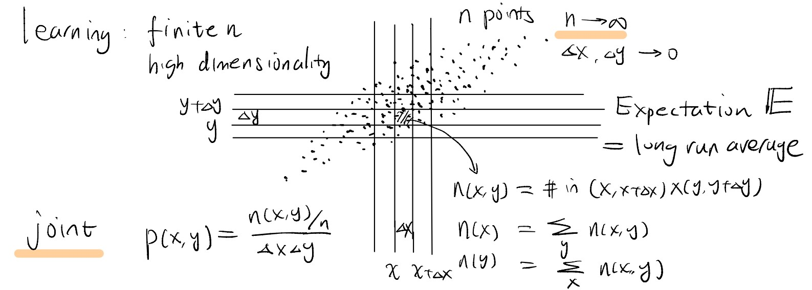
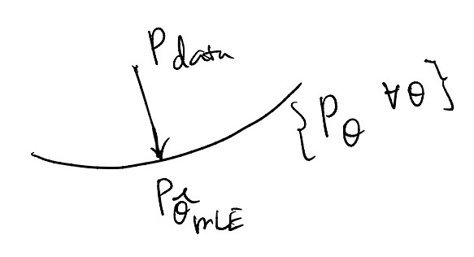
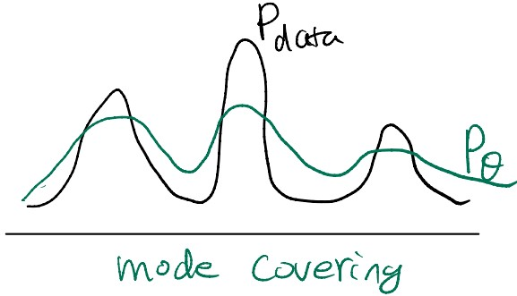
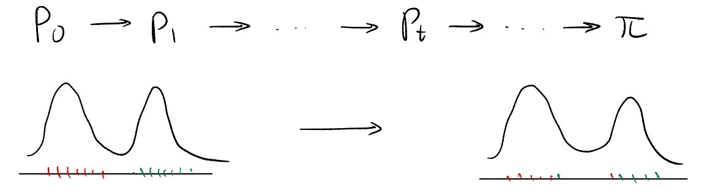
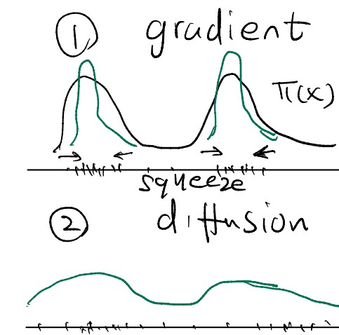
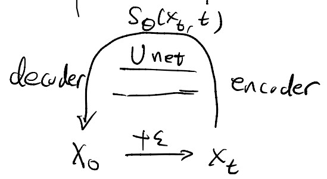

# Generative Modeling Explained

This tutorial is refined from Ying Nian Wu's tutorial on generative modeling. The tutorial goes over the key equations and algorithms for learning recent generative models, including energy-based models, diffusion/score-based models, autoregressive/flow-based models, VAEs, and GANs, and explains the connections between these models. **In contrast to most current tutorials on generative modeling from the perspective of machine learning, this tutorial is unique for providing a more basic and natural perspective form statistics.** Starting with the very basic probability background, the tutorial is extremely learner-friendly.

## Highlights & Significance

The tutorial connects different families of generative models from multiple perspectives---original formulation, the essence of sampling process, and variational formulation. 

Sampling a high-modality distribution is hard. Diffusion model factorizes the problem of sampling from the high-modality distribution into a thousand of small incremental steps, making the sampling much more tractable. VAE follows an elegant formulation trying to sample the data distribution in a single trial, however the estimated aggregated posterior may mismatch the prior. GAN also suffers from single trial, but uses a discriminator to guide the generation.

## About the Instructor

[Dr. Ying Nian Wu](http://www.stat.ucla.edu/~ywu/) is currently a professor in Department of Statistics, UCLA. He received his A.M. degree and Ph.D. degree in statistics from Harvard University in 1994 and 1996 respectively. He was an assistant professor in the Department of Statistics, University of Michigan from 1997 to 1999. He joined UCLA in 1999. He has been a full professor since 2006. Wu’s research areas include generative modeling, representation learning, computer vision, computational neuroscience, and bioinformatics.

## Prerequisite: Probability Density

> As long as you can count, you understand everything about probability density.

Consider a clot in the 2-D space, with n example data points. **The Probability Density tells you how the points are distributed.** As the number of data points can become extremely large ($n\rightarrow\infty$), we have an almost continuous clot demonstrating the data. 

<figcaption align = "center"><b>A visual demonstration of probabilistic density</b></figcaption>

To Analyze the continuous density, we can discretize spaces into $\Delta x\rightarrow 0$ and $\Delta y\rightarrow 0$.

### Understand Basic Concepts by Counting

Consider the number of data points a cell (shadowed area), we have:
$$n(x,y)=\text{Count}(x,x+\Delta x)\times (y,y+\Delta y),$$ 
then $n(x)$ is the number of points in the vertical bin $(x,x+\Delta x)$:
$$n(x)=\sum_{y} n(x,y),$$
and similarly, $n(y)$ is the number of points in the horizontal bin $(y,y+\Delta y)$:
$$n(y)=\sum_{x} n(x,y).$$

### Joint Density

On the basis, we have joint density as:
$$p(x,y)=\frac{n(x,y)/n}{\Delta x \Delta y},$$
where the numerator is normalized by the total number of points. Visually, $p(x,y)$ is the proportion of the points in the cell $(x,x+\Delta x)\times(y,y+\Delta y)$ to all the points. This is in line with all the definitions of density in general, such as population density, energy density, *etc*.

Given the most important concept, we can work on the three elementary operations---marginalization, conditioning, and factorization.

### Marginalization

Calculating $p(x)$ given $p(x,y)$ is marginalization. This is projecting the two-dimensional view into the one dimension x-axis. Visually, $p(x)$ is the proportion of the points in the bin $(x,x+\Delta x)$ to all the points. Hence, we have:
$$p(x)=\frac{n(x)/n}{\Delta x}=\int p(x,y)dy.$$

### Conditioning

Calculating $p(y|x)$ given $p(x,y)$ is conditioning. This means that we are only focusing on the points in a particular bin $(x,x+\Delta x)$, ignoring all the other bins. Visually, $p(y|x)$ is the proportion of the points in the cell $(x,x+\Delta x)\times(y,y+\Delta y)$ to only the points in the bin $(x,x+\Delta x)$. Hence, we have:
$$p(y|x)=\frac{n(x,y)/n(x)}{\Delta y}=\frac{p(x,y)}{p(x)}.$$

### Factorization

On the basis of conditioning and marginalization, we have the factorization operation:
$$p(x,y)=p(x)p(y|x).$$
This equation shows that the joint distribution lies in the center of probability density---we can execute all the operations given the joint distribution.

### Expectation

The expectation $\mathbb{E}$ measures the average of the corresponding distribution in the long run. Visually, $\mathbb{E}\_{p(x,y)}$ is the average over all the $n$ points, $\mathbb{E}\_{p(x)}$ is the average over all points projected to the x-axis, and $\mathbb{E}\_{p(y|x)}$ is the average with the points in the vertical bin $(x,x+\Delta x)$.

## The Core Problem: Density Estimation

> The *gold standard* for density estimation is Maximum Likelihood Estimation.

The real world is not counting points in a 2-D space. In fact, most data comes with a high-dimensional space, and the number of examples $n$ is always finite. Thus, we have no access to the ideal continuous space with countable points in each cell, where is usually a high-dimensional cube (*a.k.a.* hypercube) with points compressively distribute at its surface. This problem is generally acknowledged as *the curse of dimensionality*.

Given the problem, what could we do? The intuitive way is to estimate a function to capture the properties of such probabilistic density. We have to parametrize the probabilistic density and try to learn the underlying parameters from finite examples. **We hope the learned density of the finite examples can generalize to infinite examples.**

### Maximum Likelihood Estimation

Maximum Likelihood Estimation (MLE) is the basic idea to estimate a density function.

Given finite $n$ example $x_1,x_2,\dots,x_n \sim p_{data}(x), x\in\mathbb{R}^D$, where each $x$ is a D-dimensional vector (D can be very large) and is independent and identically distributed in the data. We design a model $p_\theta(x)$ to parametrize the density where $\theta$ denotes all the parameters of the model, *e.g.*, a neural network. In most times, $p_\theta(x)$ is implicited and can only be obtained by the marginalization operation. 

Now we come to the core of the MLE---defining the log-likelihood function:
$$L(\theta)=\frac{1}{n}\sum\_{i=1}^n \log p\_\theta(x\_i).$$
The underlying logic of taking $\log$ of the density is: density is always positive, and $\log$ function maps it to the whole range. As the function is essentially an average over all the data points, we can derive it to an expectation form:
$$\begin{aligned} L(\theta)&=\frac{1}{n}\sum\_{i=1}^n \log p\_\theta(x\_i)\\ \newline &=\mathbb{E}\_{p\_{data}}\big\[\log p\_\theta(x)\big\].\end{aligned}$$
Our objective is to maximize the log-likelihood function, that $\theta$ to assign maximum probabilistic density to all the examples:
$$\hat{\theta}\_{MLE}=\arg\max\limits\_{\theta} L(\theta).$$

### Another Perspective on MLE: Kullback-Leibler Divergence

Kullback-Leibler Divergence (KL-Divergence) measures the difference between two distributions $p$ and $q$, is formulated as:
$$D\_{KL}(p \| q)=\mathbb{E}\_p\Bigg\[\log\frac{p(x)}{q(x)}\Bigg\].$$
A KL-Divergence's view of MLE is treating the two distributions as the groundtruth distribution of the data and the distribution estimated the model, respectively. Hence, we have:
$$\begin{aligned}D\_{KL}(p\_{data}\| p\_\theta)&=\mathbb{E}\_{p\_{data}}\big\[\log p\_{data}(x)\big\]-\mathbb{E}\_{p\_{data}}\big\[\log p\_\theta(x)\big\]\\ \newline &=-\text{Entropy}(p_{data})-L(\theta).\end{aligned}$$ 
Trivially, if we are trying to maximize $L(\theta)$, we are minimizing the KL-Divergence between $p_{data}$ and $p\_{\theta}$. This KL-Divergence view does provide us with some insights about density estimation---the model varying $\theta$ is lying on a manifold (so-called information geometry picture) and the data density is a point that may not belong to the manifold. But we are projecting the data density point to the model manifold and MLE provides the best approximation to the data density.

<figcaption align = "center"><b>Projecting data to the model manifold</b></figcaption>

Since we are calculating the expectation over $p\_{data}$, we cannot miss any mode of the data, otherwise we get a rather big KL-Divergence. This is the *mode covering* behavior of generative models. This raises a core problem of generative modeling---if your model is not expressive enough, you end up with either diffused or dispersed densities. In the remainder of this tutorial, we are going over different models trying to resolve the problem.

<figcaption align = "center"><b>The model covering behavior</b></figcaption>

## Energy-based Model

> Energy-based Model (EBM) is the most basic generative model.

### Formulating EBM

The target density $p\_\theta(x)$ can be obtained as:
$$\log p\_\theta(x)=f\_\theta(x)+\text{const}, $$
where $f\_\theta(x)$ is a bottom-up neural network and $const$ is a normalizing term. Transforming the $\log$ into exponential, we have:
$$p\_\theta(x)=\frac{1}{Z(\theta)}\exp\big(f\_\theta(x)\big),$$
where $f\_\theta(x)$ is the negative energy and $Z(\theta)=\int\exp\big(f\_\theta(x)\big)dx$ is the partition function to normalize $p\_\theta(x)$.

### Learning EBM

We can calculate the derivative over $\theta$ using the chain rule, obtaining:
$$\begin{aligned}\frac{\partial}{\partial\theta}\log Z(\theta)&=\frac{1}{Z(\theta)}\int\exp\big(f\_\theta(x)\big)\frac{\partial}{\partial\theta}f\_\theta(x)dx\\ \newline &=\mathbb{E}\_{P\_\theta}\Bigg[\frac{\partial}{\partial\theta} f\_\theta(x)\Bigg],\end{aligned}$$
where we get an important property that $\frac{\partial}{\partial\theta}\log Z(\theta)=\mathbb{E}\_{P\_\theta}\big\[\nabla\_\theta f\_\theta(x)\big\]$. 

Bringing the EBM formulation into the MLE formulation, we have:
$$\begin{aligned}L(\theta)&=\frac{1}{n}\sum\_{i=1}^n \log p\_\theta(x\_i)\\ \newline &=\frac{1}{n}\sum\_{i=1}^n f\_\theta(x\_i)-\log Z(\theta),\end{aligned}$$
and the derivative of $L(\theta)$ is:
$$\begin{aligned}L'(\theta)&=\frac{1}{n}\sum\_{i=1}^n\nabla\_\theta f\_\theta(x\_i)-\mathbb{E}\_{p\_\theta}\big\[\nabla\_\theta f\_\theta(x)\big\]\\ \newline &=\mathbb{E}\_{p\_{data}}\big\[\nabla\_\theta f\_\theta(x)\big\]-\mathbb{E}\_{p\_\theta}\big\[\nabla\_\theta f\_\theta(x)\big\].\end{aligned}$$

However, computing the expectation is extremely hard. We have to use Monte-Carlo Sampling to draw examples from the estimated density. The goal is to match the average of observed examples and the average of synthesized examples. The main problem of learning EBM is that sampling from the model density is non-trivial at all.

### Contrastive Divergence

Following the KL-Divergence perspective, we can also interpret the Monte-Carlo Sampling process for EBM in a similar way: consider the model in $t$ step $\theta\_t$, we have the Contrastive Divergence (CD):
$$\begin{aligned}C(\theta)&=D\_{KL}(p\_{data}(x)\parallel p\_\theta(x)) - D\_{KL}(p\_{\theta\_t}(x)\parallel p\_\theta(x))\\ \newline &=\mathbb{E}\_{p\_{data}}\big\[\log p\_{data}(x)\big\]-\mathbb{E}\_{p\_{data}}\big\[\log p\_\theta(x)\big\]-\mathbb{E}\_{p\_{\theta\_t}}\big\[\log p\_{\theta\_t}(x)\big\]+\mathbb{E}\_{p\_{\theta\_t}}\big\[\log p\_\theta(x)\big\],\end{aligned}$$
and the $-\log Z(\theta)$ term in $\mathbb{E}\_{p\_{data}}\big\[\log p\_\theta(x)\big\]$ and $\mathbb{E}\_{p\_{\theta\_t}}\big\[\log p\_\theta(x)\big\]$ is cancelled by each other. This provides an important merit that $L'(\theta\_t)=C'(\theta\_t)$, making the computation much more tractable.

### Another Interpretation: Self-Adversarial Training

If we treat the current model $p\_{\theta\_t}$ as an actor generating synthesized examples, and the learned model $p\_{\theta}$ as a critic---the current model is criticized to get closer to the real data density and away from current model density---we are obtaining an adversarial interpretation of CD. This reflects the idea of W-GAN. 

### Another Interpretation: Noise Contrastive Estimation

Noise Contrastive Estimation (NCE) introduces a reference distribution $q(x)$ into the formulation of $p\_\theta(x)$:
$$p\_\theta(x)=\frac{1}{Z(\theta)}\exp\big(f\_\theta(x)\big)q(x),$$
where $q(x)$ serves as a more informative density (*e.g.*, white noise $\mathcal{N}(\mathcal{0},\mathcal{I})$) than the uniform density in the original formulation of EBM.

To learn the model, a more practical way is to view the problem from an adversarial perspective. If we draw $n$ true examples from the model $x\_1,\dots,x\_i,\dots,x\_n\sim p\_\theta$ that are labelled with $y\_i=1$, and draw $n$ faked examples from the noise $\tilde{x}\_1,\dots,\tilde{x}\_i,\dots,\tilde{x}\_n\sim q$ that are labelled with $y\_i=0$, then we can calculate the posterior distribution of the real examples given random $x$:
$$p(y=1|x)=\frac{\frac{1}{2}p\_\theta(x)}{\frac{1}{2}p\_\theta(x)+\frac{1}{2}q(x)},$$
applying the Bayes rule, we obtain:
$$\log\frac{p(y=1|x)}{p(y=0|x)}=f\_\theta(x)+\text{const},$$
where the left-hand-side defines a discriminator, and $f\_\theta(x)$ here is a logit score. Hence, we are essentially learning a binary classifier, which is much more easier than MLE because we do not need to deal with the model density.

## Sampling Process for Learning EBM

> Small steps get us to faraway places. 不積跬步，無以至千里。

As aforementioned, the core problem of generative modeling is estimating the model density. In this section, we are starting with reviewing the commonly used sampling method, Langevin Dynamics, a special case of Markov-Chain Monte-Carlo (MCMC) Sampling. 

### Langevin Dynamics

We cannot sample from the model density all at once. Hence, we use Langevin Dynamics to sample in steps alone the time-axis. Here we denote the target distribution $p\_\theta(x)$ as $\pi(x)$. Starting from a noise distribution, after a few steps of sampling, we hope that $\pi(x)$ can come to the stationary distribution, or the equilibrium distribution. 

We discretize the time axis and each $\Delta t$ is an iteration step. The single-step updating is:
$$x\_{t+\Delta t}=x\_t+\frac{\Delta t}{2}\nabla\_x\log\pi(x)+e\_t\sqrt{\Delta t},$$
where $\nabla\_x\log\pi(x)$ is the gradient of the target density for executing the gradient ascent, which is called *score*. The term $e\_t$ is a random variable at each step where $\mathbb{E}\[e\_t\]=0$ and $\text{Var}\[e\_t\]=\mathcal{I}$. The scalar $\sqrt{\Delta t}$ serves to normalize the perturbation. Langevin Dynamics is a general process to sample from arbitrary density.

<figcaption align = "center"><b>A visualization of the Langevin Dynamics</b></figcaption>

### Stochastic Differential Equation

Consider the time step becomes very small, *i.e.*, $\Delta t\rightarrow 0$---the updating equation becomes a Stochastic Differential Equation (SDE):
$$dx\_t=\frac{1}{2}\nabla\_x\log\pi(x)dt+dB\_t,$$
where $B\_t$ denotes $e\_t\sqrt{\Delta t}$. 

A more sophiscated version of MCMC Sampling is Hamiltonian Monte-Carlo (HMC), which adds a momentum to smooth the trajectory.

### Understanding Langevin Dynamics: Equilibrium Sampling

An interesting observation in Langevin Dynamics is: once $p\_t(x)$ have converged to $\pi\_t(x)$, then Langevin Dynamics will maintain the marginal distribution of $\pi\_t(x)$ in the following steps, keeping it at equilibrium. 

How does this come? Let us look back into the updating equation of Langevin Dynamics, into the two terms---the gradient ascent term $\frac{\Delta t}{2}\nabla\_x\log\pi(x)$ and the perturbation term $e\_t\sqrt{\Delta t}$. Imagine an analogous scene that we are working with many particles instead of only sampling one point each time. In the gradient ascent step, as the model tends to update according to the gradient, the particles are *squeezed* to areas with more particles, thus making the density peaks sharper. In the perturbation step, as we are adding variance, the model become diffused, thus making the density more smooth. The two terms counteract the effect of each other---the gradient ascent term push the density to be more sharp at local modes, while the perturbation term disperse the local modes to smooth the density.

<figcaption align = "center"><b>Explaining Langevin Dynamics with (1) gradient ascent as squeezing; (2) random pertubation as diffusion</b></figcaption>

To analyze the phenomenon mathematically, we may look into the Taylor expansion of the testing function $\mathbb{E}\big\[h(x\_{t+\Delta t})\big\]$.Expanding $\frac{\Delta t}{2}\nabla\_x\log\pi(x)$ leads to a first-order Taylor remainder and expanding $e\_t\sqrt{\Delta t}$ leads to a second-order Taylor remainder. Since the two terms have opposite signs, they cancelled the effect of each other. This is identified as the Fokker-Planck effect.

On the basis of equilibrium sampling, we are introducing score-based/diffusion models.

### Tempering & Annealing

Though coming with the merit of equilibrium sampling, Langevin Dynamics suffers from very slow convergence, especially when the model density has a lot of localized modes (high modalities). To address this problem, we introduce a temperature parameter $\beta\in\[0,1\]$ into the EBM formula:
$$\pi\_\beta(x)=\frac{1}{Z\_\beta(x)}\exp\big(\beta f(x)\big)q(x),$$
where $q(x)\sim\mathcal{N}(0,\mathcal{I})$. As $\beta$ increasing from 0 to 1, we are sampling from a simple Gaussian to a highly multi-modal density. This process is called Simulated Annealing. A principled implementation of Simulated Annealing is running parallel chains to draw samples from $\beta=0$ to $\beta=1$ simultaneously, with the exchange of samples among models.

## Diffusion/Score-based Models

> Imagine you are playing the golf. You can exactly see where the hole $x\_0$ is. But you want to use *a thousand strokes* to shoot back to the hole. You do not want to shoot back in a stroke because the chance you hit the hole is very small. Rather, you see where the hole is, and you are going toward the hole by small steps.

Unlike the EBM where we directly target to the log-density, the Diffusion model essentially learns a sampling process. Diffusion model tries to decompose sampling the density into a large number of very small incremental steps.

### Forward: From Clean Image to Noise

The forward process of Diffusion model is gradually adding noise to a clean image until it becomes a Gaussian, using non-equilibrium sampling.

Let $x\_0$ denote the clean image and $x\_t$ denote the image with noise level $t$, from noise level $x\_{t}$ to $x\_{t+\Delta t}$, we have:
$$x\_{t+\Delta t}=x\_t+\delta e\_t\sqrt{\Delta t}-\frac{\delta^2\Delta t}{2}\nabla\_x\log p\_t(x).$$
Let us look into the equation, where $\delta e\_t\sqrt{\Delta t}$ is the random step of adding perturbation, and $\frac{\delta^2\Delta t}{2}\nabla\_x\log p\_t(x)$ is the deterministic step of gradient descent. Recall the Fokker-Planck effect introduced in the Langevin Dynamics. The only difference lies in the deterministic step---in contrast to gradient ascent in the updating of Langevin Dynamics, forward updating Diffusion model applies gradient descent. Consequently, the effect of gradient descent is opposite to that of gradient ascent---in the gradient descent step, as the model tends to update according to the gradient, the particles are *stretched* away from areas with more particles, thus making the density peaks more smooth. Hence, we can see that both the deterministic step and the random step lead to dispersion on the density. 

We can also look into the Taylor expansion of the testing function $\mathbb{E}\big\[h(x\_{t+\Delta t})\big\]$.Expanding $\frac{\delta^2\Delta t}{2}\nabla\_x\log\pi(x)$ leads to a first-order Taylor remainder and expanding $\delta e\_t\sqrt{\Delta t}$ leads to a second-order Taylor remainder. Since the two terms have the same sign, instead of cancelling the effect of each other, they actually have the same effect. This is the non-equilibrium sampling process.

### Reverse: From Noise Back to Image

After changing the clean image into white noise, now we are trying to walk back. 

We only need to reverse the deterministic step, from noise level $x\_{t+\Delta\_t}$ to $x\_t$, we have:
$$\tilde{x}\_t=x\_{t+\Delta t}+\frac{\delta^2\sqrt{\Delta t}}{2}\nabla\_x\log p\_{t+\Delta t}(x\_{t+\Delta t}).$$

### Ordinary & Stochastic Differential Equation 

Similar to Langevin Dynamics, we have two variants of reverse updating when the time steps become very small, (*i.e.*, $\Delta t\rightarrow 0$).

If we only consider the deterministic step, we have Ordinary Differential Equation (ODE):
$$dx\_t=-\frac{\delta^2}{2}\nabla\_x\log p\_t(x\_t)dt,$$
where $p\_t(x\_t)$ is the image density in noise level $t$.

If we consider the random step, we have Stochastic Differential Equation (SDE):
$$dx\_t=-\delta^2\nabla\_x\log p\_t(x\_t)+\delta d\tilde{B}\_t,$$
where $d\tilde{B}\_t=d\tilde{e}\_t\sqrt{\Delta t}=\frac{\tilde{e}dt}{2\sqrt{\Delta t}}$. The SDE formulation can be interpreted as going two reverse steps from $p\_{t+\Delta t}$ to $p\_{t-\Delta t}$, then going one forward step from $p\_{t-\Delta t}$ to $p\_t$. This provides a merit that SDE is more appliable if we cannot estimate $p\_t$ accurately.

### Vincent Identity

Here we go into the core problem of learning a Duffusion model: how do we estimate the score $\nabla\_x\log p\_t(x\_t)$? Vincent Identity provides us with a very powerful tool that $\nabla\_x\log p\_t(x\_t)=\mathbb{E}\_{p(x\_0|x\_t)}\big\[-(x\_t-x\_0)/\sigma\_t^2\big\]$.

From the clean image $x\_0\sim p\_0$, the Diffusion model gradually adds noise in the forward process to $x\_t\sim p\_t$, then we have:
$$x\_t=x\_0+\mathcal{N}(0,\sigma^2t\mathcal{I}),$$
where $\sigma^2t$ is the noise accumulated in the $t$ levels. Then we derive the Vincent Identity:
$$ \begin{aligned} \nabla\_x\log p\_t(x\_t)&=\frac{1}{p\_t(x\_t)}\nabla\_x p\_t(x\_t)\\ \newline &=\frac{1}{p\_t(x\_t)}\int\nabla\_{x\_t}p(x\_0,x\_t)dx\_0\\ \newline &=\frac{1}{p\_t(x\_t)}\int\big(\nabla\_{x\_t}\log p(x\_0,x\_t)\big)p(x\_0,x\_t)dx\_0\\ \newline &=\int\big(\nabla\_{x\_t}\log p(x\_0,x\_t)\big)\frac{p(x\_0,x\_t)}{p\_t(x\_t)}dx\_0\\ \newline &=\int\big(\nabla\_{x\_t}\log p(x\_0,x\_t)\big)p(x\_0|x\_t)dx\_0\\ \newline &=\mathbb{E}\_{p(x\_0|x\_t)}\Big\[\nabla\_{x\_t}\big(\log p(x\_0)p(x\_t|x\_0)\big)\Big\]\\ \newline &=\mathbb{E}\_{p(x\_0|x\_t)}\Big\[\nabla\_{x\_t}\big(\log p(x\_0)+\log p(x\_t|x\_0)\big)\Big\]\\ \newline &=\mathbb{E}\_{p(x\_0|x\_t)}\big\[\nabla\_{x\_t}\log p(x\_t|x\_0)\big\]\\ \newline &=\mathbb{E}\_{p(x\_0|x\_t)}\big\[\nabla\_{x\_t}(x\_t-x\_0)^2/2\sigma\_t^2\big\]\\ \newline &=\mathbb{E}\_{p(x\_0|x\_t)}\big\[-(x\_t-x\_0)/\sigma\_t^2\big\]. \end{aligned}$$
From line 1 to line 2 we integrate over $x\_0$ to obtain the joint distribution $p(x\_0,x\_t)$. Then we employ a common trick for taking a derivative of a density in the integral that puts $\log$ into the derivative operator in line 3. From line 4 to line 5 we put $\frac{1}{p(x\_0)}$ into the integral and obtain the conditional density. From line 6 we rewrite the integral into a expectation form. Line 7 shows the merit of adding the $\log$ term, we expand the factorized joint distribution into a simple addition and calculate their derivatives respectively. 

### Score Matching/Denoising Auto-Encoder

On the basis of the Vincent Identity, we have:
$$\mathbb{E}\big\[p(x\_0|x\_t)\big\]=x\_t+\sigma^2t\nabla\_x\log p\_t(x\_t),$$
where $x\_0$ is the clean image and $\sigma^2t$ is the accumulated noise. Hence, we can estimate the score in a regression fashion where the objective is to predict $x\_0$ given $x\_t$, formulated as:
$$\min\limits\_{\theta}\Big|x\_0-\big(x\_t+\sigma^2ts\_\theta(x\_t,t)\big)\Big|^2,$$
and this gives us a Denoising Auto-Encoder. We can parametrize this in a U-Net. A U-Net encodes the noisy version of the image and decodes back to the clean version of the image, with the encoder and decoder sharing parameters. We can learn a single U-Net for all levels of noise by taking noisy level $x\_t$ and $t$ as the input variables of the model. $t$ can be embedded as expressive vectors $\sin\omega t+\cos\omega t$, which is similar to the positional encoding in the Transformer model. 

<figcaption align = "center"><b>U-Net: encoding the noisy version of the image to decode the clean version of the image</b></figcaption>

Under this implementation, we take relatively big steps to estimate noise:
$$\Big|\varepsilon-\big(x\_t+\sigma^2ts\_\theta(x\_0+\varepsilon,t)\big)\Big|^2,$$
where $\varepsilon$ is the estimated noise level step size, and we then take relatively small steps to denoise:
$$\tilde{x}\_{t-\Delta t}=x\_t+\frac{\sigma^2\Delta t}{2}s\_\theta(x\_t,t).$$

### Another Formulation: Variational

We can alternativelly reform the score-based methods into a variational way. The forward process from $x\_{t-\Delta t}$ to $x\_t$ is quite similar to score-based methods:
$$x\_t=x\_{t-\Delta t}+\mathcal{N}(0,\sigma^2\Delta t\mathcal{I}).$$
But in the reverse process for estimating $x\_0$, variational methods focus on the conditional distribution, which is distinct from the score-based methods focusing on marginal distributions:
<!--- $$ \begin{aligned} p(x\_{t-\Delta t}\|x\_t)&\propto p(x\_{t-\Delta t})q(x\_t\|x\_{t-\Delta t})\\ \newline \log p(x\_{t-\Delta t}\|x\_t)&=\log p(x\_{t-\Delta t})-\frac{1}{2\sigma^2\Delta t}\|x\_{t-\Delta t}-x\_t\|^2 \end{aligned}$$ --->
$$ \begin{aligned} p& a\\ \newline q & b \end{aligned}$$
The derivation starts from applying the Bayes rule to obtain $p(x\_{t-\Delta t}|x\_t)$. As $q(x\_t|x\_{t-\Delta t})$ is Gaussian noise, We can approximate the conditional density to a Gaussian density *iff* $\Delta t$ is very small, *i.e.*, $\Delta t\rightarrow 0$. Applying first-order Taylor expansion, we have:
$$ \begin{aligned} \log p(x\_{t-\Delta t}|x\_t)&\approx\log p\_(x\_t)+\nabla\_x\log p(x\_t)(x\_{t-\Delta t}-x\_t)-\frac{1}{2\sigma^2\Delta t}|x\_{t-\Delta t}-x\_t|^2\\ \newline &=-\frac{1}{2\sigma^2\Delta t}\Big|x\_{t-\Delta t}-\big(x\_t+\sigma^2\Delta t\nabla\_x\log p(x\_t)\big)\Big|^2+\text{const}\\ \newline &\approx\mathcal{N}\big(x\_t+\sigma^2\Delta t\nabla\_x\log p(x\_t),\sigma^2\Delta t\mathcal{I}\big). \end{aligned}$$
Hence, this variational formulation transforms the extremely hard conditional distribution estimation to a very simple Gaussian distribution.

Recall our gold standard, MLE---as we have obtained the conditional distribution, naturally we can formulate the variational form in KL-Divergence:
$$D\_{KL}\Big(p(x\_0)\prod\_{t}q(x\_t|x\_{t-1})\Big\|\prod\_tp\_\theta(x\_{t-\Delta t}|x\_t)\Big),$$
where the left distribution is the complete data distribution of the entire forward process; specifically, $p(x\_0)$ is the observed data and $\prod\_{t}q(x\_t|x\_{t-1})$ is the joint distribution of latent variables; the right distribution is the model density. 

In the reverse process, we can execute noise reduction by decomposing the KL-Divergence:
$$\sum\_t D\_{KL}\big(q(x\_{t-\Delta t}|x\_t,x\_0)\big\|p\_\theta(x\_{t-\Delta t}|x\_t)\big),$$
since both distributions are Guassian:
$$q(x\_{t-\Delta t}|x\_t,x\_0)\sim\mathcal{N}\big(\mu(x\_t,x\_0),0\big),p\_\theta(x\_{t-\Delta t}|x\_t)\sim\mathcal{N}\big(M\_\theta(x\_t),\sigma^2\Delta t\mathcal{I}\big),$$
where $M\_\theta$ is a U-Net model with parameters $\theta$. We can rewrite the KL-Divergence in closed-form as:
$$\min\limits\_\theta\big|M\_\theta(x\_t)-\mu(x\_t,x\_0)\big|^2/\sigma^2\Delta t,$$
where the noise estimation can be reparametrized as $|\varepsilon-\varepsilon\_0(x\_t,t)|^2$.

### Relations with Other Generative Models

Diffusion model can be viewed as the Auto-regressive model in the time domain, which reverse the time, going from white noise $x\_t$ to the clear image $x\_0$.

Diffusion model can be viewed as the Flow-based model. Flow-based model starts from white noise $Z\sim\mathcal{0,\mathcal{I}\_D}$ ($D$ is the dimension of data) and use a sequence of transformations to generate $x=g\_1(g\_2(\cdots g\_t(z)))$. Each trasformation $g\_i$ has to be in very stricted form and invertible. Hence, the Deffusion model can be viewed as a more free-formed Flow-based model without restrictions and invertibility.

Diffusion model can be viewed as a refined version of Variational Auto-Encoder (VAE). VAE starts from white noise $Z\sim\mathcal{N}(0,\mathcal{I}\_d), d<<D$ and generates $x=g(z)+\varepsilon, \varepsilon\sim\mathcal{N}(0,\sigma^2\mathcal{I}\_D)$. The KL-Divergence for learning VAE by MLE is:
$$\begin{aligned} D\_{KL}&=\big(p\_{data}(x)q\_\phi(z|x)\big\|p(z)p\_\theta(x|z)\big)\\ \newline &=D\_{KL}\big(p\_{data}(x)\big\|p\_\theta(x)\big)+D\_{KL}\big(q\_\phi(z|x)\big\|p\_\theta(x|z)\big). \end{aligned}$$
VAE estimates $x\_0$ in one-shot. Analogous to the golf example, in contrast to Diffusion model that reaches the target in a thousand strokes, VAE is trying to send the golf into the hole using only one stroke. Hence, this can be very inaccurate.

